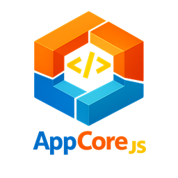
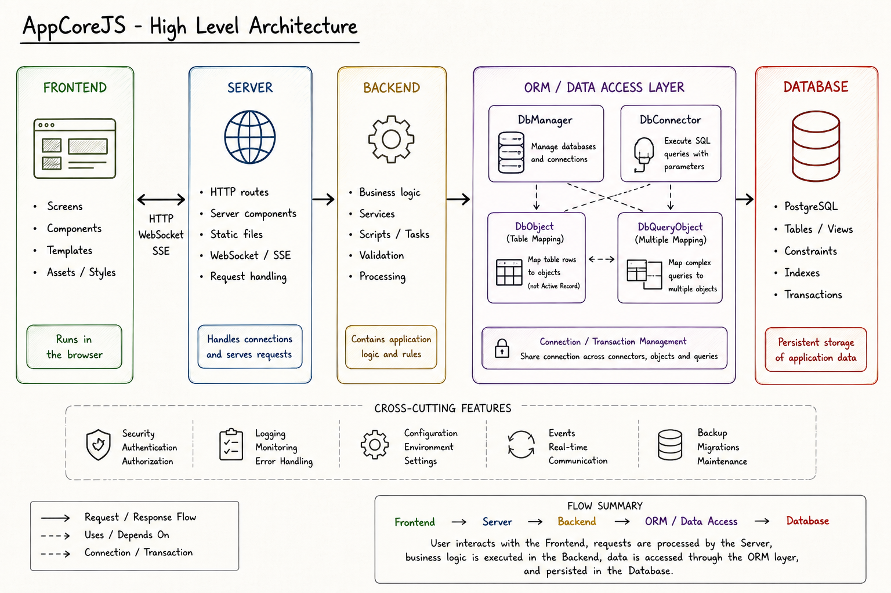

<p align="center">
  
</p>

# AppCore<sub>JS</sub> Framework

AppCore<sub>JS</sub> is a **lightweight JavaScript framework** and **application generator** focused on **layered overrides**, **code factorization**, and interoperability with standard web and Node.js code.

It generates a **working application out of the box**, from backend or script projects to complete server and frontend applications. The generated structure is designed to be **extended, specialized, or overridden** instead of rewritten from scratch.

Its architecture separates the **framework core**, the **global application layer**, and the **project-specific layer**. The application layer can override core classes and global behavior once, while each project can still specialize or extend what it needs locally. This makes it possible to **factorize most of the code**, keep projects small, and adapt the framework deeply without modifying its core.

AppCore<sub>JS</sub> also provides a **complete ORM layer** that can be **generated and regenerated from multiple databases and schemas** without losing project-specific specializations.

Generated **model classes can be extended** through the same layered override approach, allowing database changes to be reflected safely while preserving custom business logic and rules.

The query system supports **advanced queries combining multiple model objects**, making it possible to build rich aggregated results, joins, search screens, detail views, and domain-specific data structures without duplicating low-level SQL logic throughout the application.

The frontend is built entirely with **standard HTML5, CSS3, and ES6 JavaScript**. AppCore<sub>JS</sub> components can be mixed naturally with regular **Node.js, HTML, CSS, and vanilla JavaScript** code, so projects are not locked into a rigid framework-only approach.

Because AppCore<sub>JS</sub> remains deliberately **lightweight**, generated applications stay **simple**, **fast to load**, and **fluid in use**.

The fundamental rule is:

```text
project -> app -> core
```

`core` is internal.
`app` is the mandatory interface.
Project code uses `app`, never `core` directly.

---

## Installation

Create a new Node.js project:

```bash
mkdir my-project
cd my-project
npm init -y
```

Install AppCore<sub>JS</sub> directly from GitHub:

```bash
npm install git+https://github.com/DzzD/appcorejs.git
```

The `app-core` CLI can then be invoked through `npx`.

---

## Quick Start

Generate a complete application:

```bash
npx app-core --back --server --front --model --project myProject --dbuser appcore --dbpassword appcore --dbname appcore
```

Generated structure:

```text
./core/
./app/
./myProject/
./myProject/public/
./server.js
./index.js
```

Run the server:

```bash
node server.js
```

Open:

* `http://127.0.0.1:3000`

---

## Global Concept

### `core`

* Internal framework engine.
* Contains framework internals.
* Not intended to be used directly.

### `app`

* Framework interface.
* Mandatory entry point.
* Place to adapt framework behavior globally.

### `project` (`./<project>/`)

* Contains business code.
* Contains business models, queries, server components, and frontend components.
* Uses `app` only.

Fundamental rule:

```text
project -> app -> core
```

Never:

```text
project -> core
```



---

## Why `app` Is Mandatory

`app` is the application's control layer.

It allows framework behavior to be changed globally without patching `core`.

Example: a global save rule in `app/db/DbObject.js`.

```js
import { CoreDbObject } from '../../core/db/CoreDbObject.js';

export class DbObject extends CoreDbObject
{
    async save(forceInsert = false)
    {
        if ('updatedAt' in this)
        {
            this.updatedAt = new Date();
        }

        return await super.save(forceInsert);
    }
}
```

The property check is functional: the rule applies only when the model contains an `updatedAt` property.

---

## Project Structure

```text
./core/
./app/
./myProject/
  db/
  server/
  public/
```

* `core/`: framework internals.
* `app/`: framework interface layer.
* `myProject/`: project-specific business layer.

---

## Domain Overview

### Backend

* ORM classes are exposed through `app/db/*`.
* Project models are located in `./<project>/db/models/`.

### Server

* The server base class is `app/server/Server.js`.
* The project server extends it from `./<project>/server/`.

### Frontend

* The frontend root is `./<project>/public/`.
* `public/core`: frontend engine.
* `public/app`: frontend interface.
* `public/components`: recommended folder for project frontend components.
* `public/screens`: optional project structure when a screen-based split is needed.
* `public/ext`: generated only with `--front --ext` or `--front --intro`.
* `public/intro`: generated only with `--front --intro`.

### Models

* Generated with `--model`.
* Project model classes are generated in `./<project>/db/models/`.
* Core base model classes are generated in `./core/db/models/`.
* Model classes are never generated in `./app/db/models/`.

---

## Documentation

Start here:

* [Documentation index](./docs/README.md)

Direct access:

* [001 - app-core CLI](./docs/001-app-core-cli.md)
* [002 - Architecture](./docs/002-architecture.md)
* [003 - Backend](./docs/003-backend.md)
* [004 - Model / ORM](./docs/004-model-orm.md)
* [005 - Server](./docs/005-server.md)
* [006 - Frontend](./docs/006-0-frontend.md)
* [007 - Examples](./docs/007-examples.md)

---

## Author

Bruno Augier (aka DzzD)
