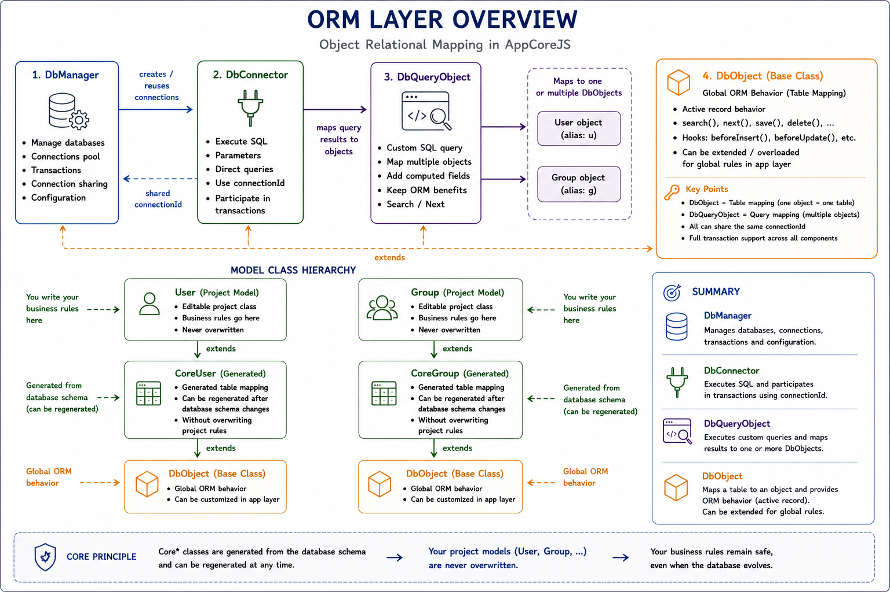
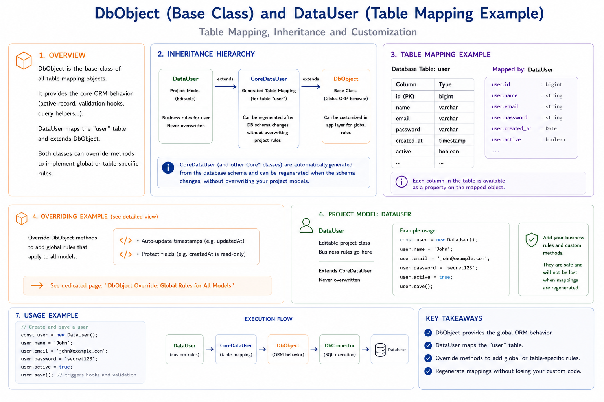
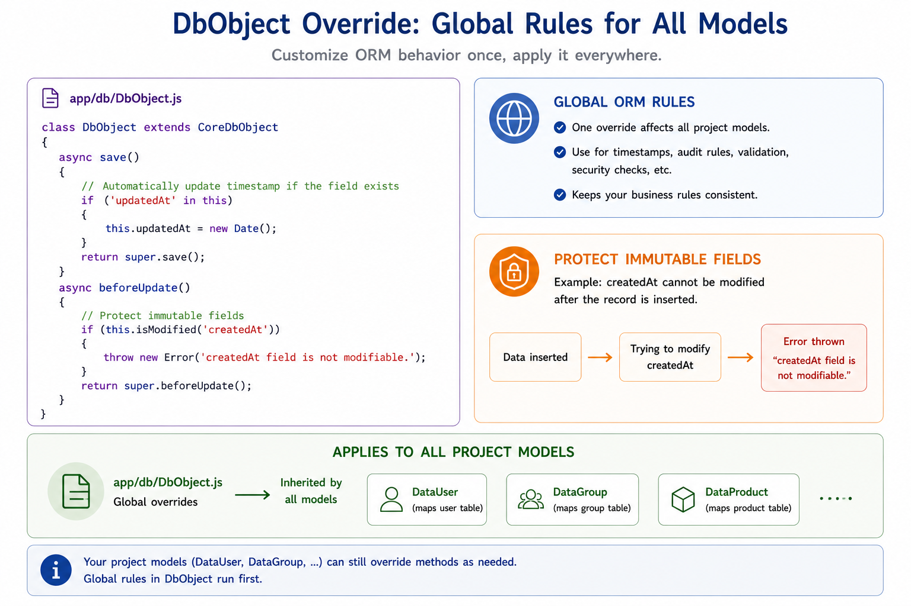
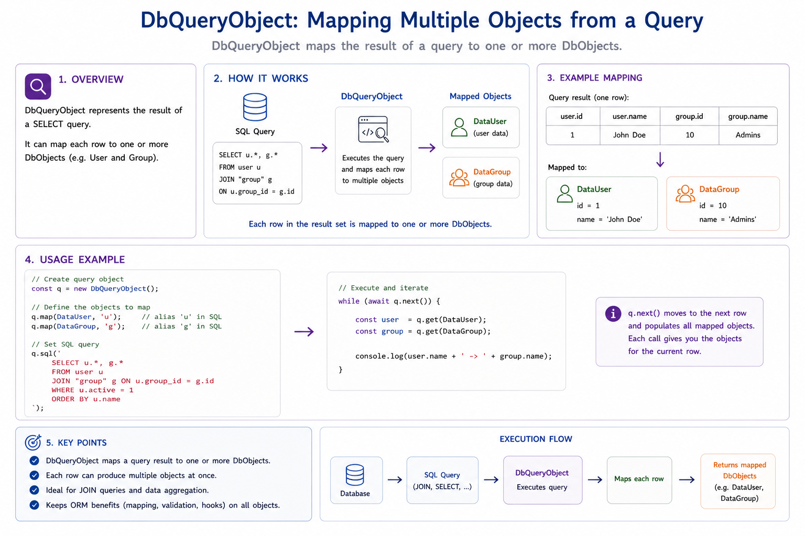
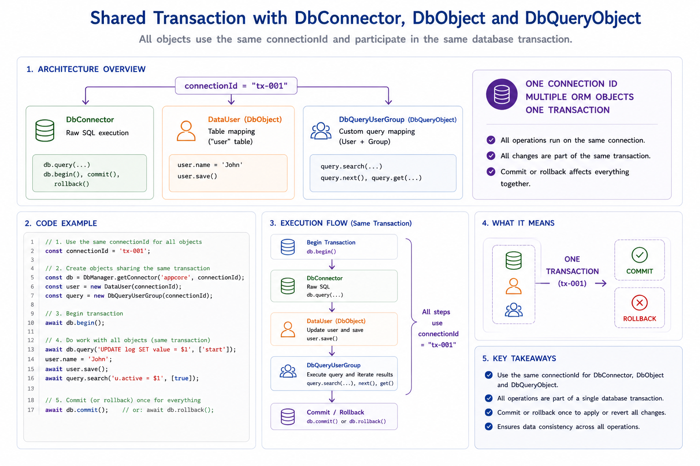
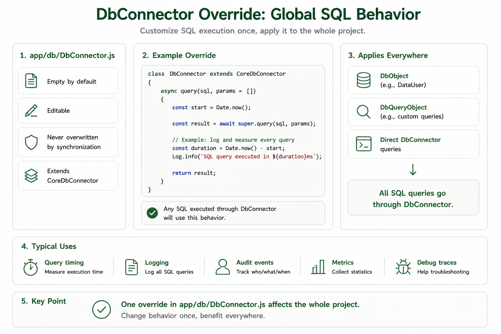

# 004 - Model / ORM


This chapter explains the ORM layer in detail.




## 0) Layer reminder

ORM classes follow this chain:

```text
<ProjectModel> -> Core<ProjectModel> -> DbObject -> CoreDbObject
```

Example:

```text
User -> CoreUser -> DbObject -> CoreDbObject
```

So:

- changing `app/db/DbObject.js` impacts all models
- changing `./<project>/db/models/User.js` impacts only `User`

---

## 1) DbManager

`DbManager` registers database configurations and manages pooled connections.

Use it once at startup:

```js
import { DbManager } from './app/db/DbManager.js';

DbManager.addDatabase(
{
    host: 'localhost',
    port: 5433,
    database: 'appcore',
    user: 'appcore',
    password: 'appcore'
});
```

You can register multiple databases if needed.

---

## 2) DbConnector

`DbConnector` executes SQL directly.

Features:

- parameterized SQL
- row iteration with `next()`
- shared connection via `connectionUid`
- transactions (`beginTransaction`, `commit`, `rollback`)

Example:

```js
const dbConnector = DbManager.getConnector('appcore', 'myConnectionId');

await dbConnector.query(
    'SELECT * FROM "user" WHERE login LIKE $1',
    ['bru%']
);

for (let row = await dbConnector.next(); row; row = await dbConnector.next())
{
    // process raw SQL row
}
```

---

## 3) DbObject

`DbObject` is the interface ORM base class.



It provides:

- `search()`
- `next()`
- `save()`
- `delete()`
- lifecycle hooks (`beforeSave`, `beforeInsert`, `afterSave`, ...)

### 3.1 Direct object search

```js
const user = new DataUser('myConnectionId');

await user.search('login LIKE $1', ['bru%']);

while (await user.next())
{
    user.login = 'modified';
    await user.save();
}
```

### 3.2 Binding object to an existing connector

```js
await dbConnector.query(`
    SELECT
        to_jsonb(ug) as ug,
        to_jsonb(u) - 'salt' as u
    FROM "user" u
    LEFT JOIN user_group ug on u.id = ug.user_id
`);

const user = DataUser.from(dbConnector, 'u');

while (await user.next())
{
    user.name = 'toto';
    await user.save();
}
```


### 3.3 Overridable ORM events

`DbObject` exposes these overridable hooks:




- `beforeSave()`
- `afterSave(success)`
- `beforeInsert()`
- `afterInsert(success)`
- `beforeUpdate()`
- `afterUpdate(success)`
- `beforeDelete()`
- `afterDelete(success)`

`success` is the operation result (`true` or `false`).
You can name this parameter `result` if you prefer.

Example:

```js
import { CoreUser } from '../../../core/db/models/CoreUser.js';

export class User extends CoreUser
{
    beforeSave()
    {
        if ('updatedAt' in this)
        {
            this.updatedAt = new Date();
        }

        return true;
    }

    beforeInsert()
    {
        if (!this.login)
        {
            return false;
        }

        return true;
    }

    afterSave(success)
    {
        if (success)
        {
            // post-save action
        }
    }
}
```

---

## 4) Global vs local overrides

### 4.1 Global rule for all models

In `app/db/DbObject.js`:

```js
import { CoreDbObject } from '../../core/db/CoreDbObject.js';

export class DbObject extends CoreDbObject
{
    async save(forceInsert = false)
    {
        if ('updatedAt' in this)
        {
            this.updatedAt = new Date();
        }

        return await super.save(forceInsert);
    }
}
```

This affects every model (`User`, `UserGroup`, ...).

### 4.2 Local rule for one model

In `./<project>/db/models/User.js`:

```js
import { CoreUser } from '../../../core/db/models/CoreUser.js';

export class User extends CoreUser
{
    beforeInsert()
    {
        if (!this.login)
        {
            return false;
        }

        return true;
    }
}
```

This affects only `User`.

---

## 5) DbQueryObject

`DbQueryObject` encapsulates business SQL and maps multiple ORM objects.



Example:

```js
import { DbQueryObject } from '../../../app/db/DbQueryObject.js';
import { DataUser } from '../models/DataUser.js';
import { DataUserGroup } from '../models/DataUserGroup.js';

export class DbQueryUserGroupByUser extends DbQueryObject
{
    constructor(connectionUid = 'default')
    {
        super('appcore', connectionUid);

        this._query = `
            SELECT
                to_jsonb(ug) as ug,
                to_jsonb(u) - 'salt' as u
            FROM "user" u
            LEFT JOIN user_group ug on u.id = ug.user_id
        `;

        this.addDbObject(DataUser, 'user', 'u');
        this.addDbObject(DataUserGroup, 'userGroup', 'ug');
    }
}
```

### 5.1 Iteration style A: drive with query.next()

```js
const query = new DbQueryUserGroupByUser('myConnectionId');

await query.search('u.login LIKE $1', ['bru%']);

const user = query.getDbObject('user');

while (await query.next())
{
    user.name = 'modified';
    await user.save();
}
```

### 5.2 Iteration style B: drive with object.next()

```js
const query = new DbQueryUserGroupByUser('myConnectionId');

await query.search('u.login LIKE $1', ['bru%']);

const user = query.getDbObject('user');

while (await user.next())
{
    user.name = 'modified';
    await user.save();
}
```

Both styles advance the same underlying connector cursor.

Use the style that reads better in your use case.

- `query.next()` is explicit at query level.
- `user.next()` can be clearer when logic mainly targets one object.

---

## 6) Shared connections and transactions

`connectionUid` lets `DbConnector`, `DbObject`, and `DbQueryObject` share one connection.



Example transaction flow:

```js
const connector = DbManager.getConnector('appcore', 'tx-1');
await connector.beginTransaction();

try
{
    const user = new DataUser('tx-1');
    await user.search('login = $1', ['bru']);

    if (await user.next())
    {
        user.login = 'bruno';
        await user.save();
    }

    await connector.commit();
}
catch (error)
{
    await connector.rollback();
    throw error;
}
finally
{
    connector.close();
}
```

---

## ORM summary

- `DbManager`: database registry + pool + connection lifecycle
- `DbConnector`: raw SQL + cursor + transactions
- `DbObject`: ORM entity API + hooks
- `DbQueryObject`: business query API + mapped ORM objects

---

## 7) Why `app/db/*` classes exist (and why they are minimal by default)

By default, ORM classes in `app/db/*` are intentionally minimal (often empty).

This is by design.

They are framework interface classes used to apply global behavior for the whole project.

Main interface classes:

- `DbManager`
- `DbConnector`
- `DbObject`
- `DbQueryObject`

When you override one of these classes in `app`, the behavior is shared across your project.

### Example: global `DbConnector` override



`app/db/DbConnector.js`

```js
import { CoreDbConnector } from '../../core/db/CoreDbConnector.js';
import { Log } from '../Log.js';

export class DbConnector extends CoreDbConnector
{
    async query(sql, params = [])
    {
        const startedAt = Date.now();

        const result = await super.query(sql, params);

        const elapsed = Date.now() - startedAt;
        Log.debug(`[sql:${elapsed}ms] ${sql}`);

        return result;
    }
}
```

This adds timing/logging to all connector queries in the project.

### Example: temporary mock mode (dev/test)

```js
import { CoreDbConnector } from '../../core/db/CoreDbConnector.js';

export class DbConnector extends CoreDbConnector
{
    async query(sql, params = [])
    {
        if (process.env.APPCORE_DB_MOCK === '1')
        {
            this._rowBuffer = [{ id: 1, login: 'mock-user' }];
            this._rowBufferIndex = -1;
            return null;
        }

        return await super.query(sql, params);
    }
}
```

This lets you run local/tests flows without hitting a real database.

## Cross-reference

- Backend overview: [003 - Backend](./003-backend.md)
- Server integration: [005 - Server](./005-server.md)
