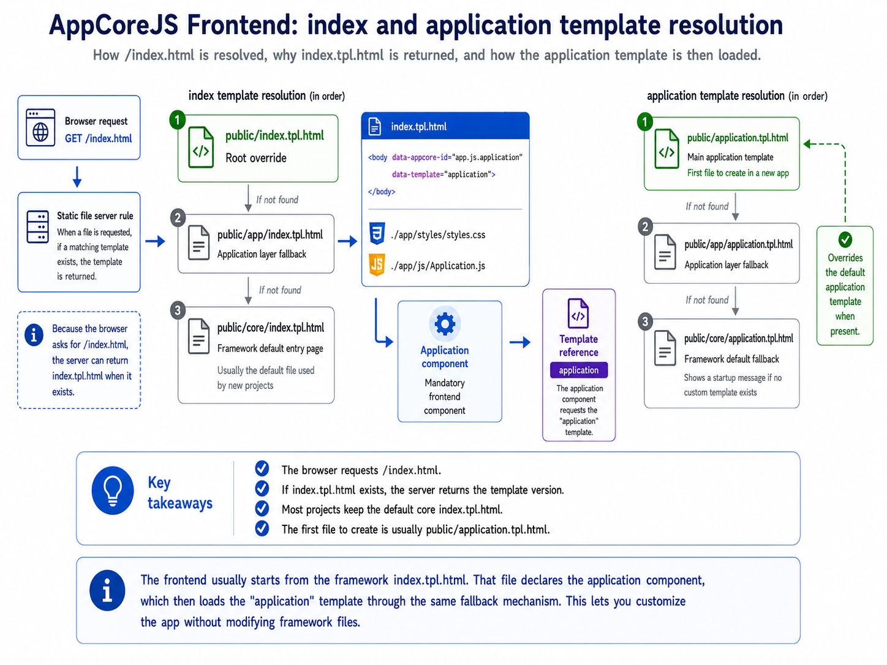
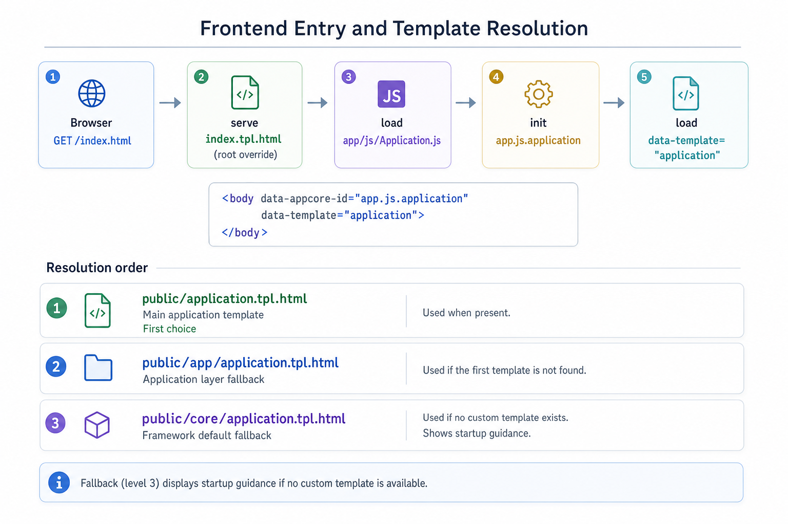
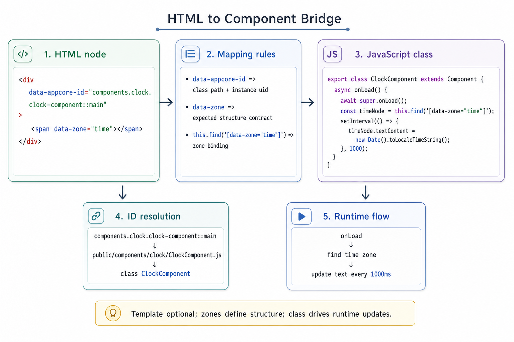
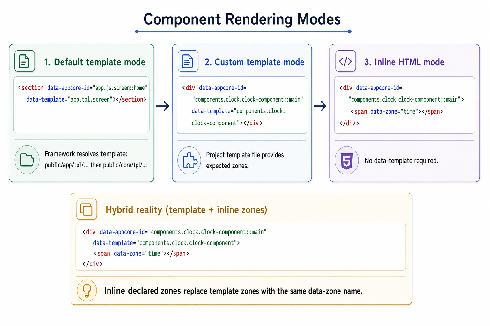

# 006 - Frontend

AppCoreJS frontend is built on top of standard HTML.

A page is mostly regular HTML, with AppCoreJS components added where behavior is needed.

The only mandatory frontend component is the application component:

```html
<body data-appcore-id="app.js.application"
      data-template="application">
</body>
```

Without this component, AppCoreJS cannot initialize frontend components.

## Default application entry

When the frontend is generated by the CLI, the framework provides a default entry point:

```text
public/core/index.tpl.html
```

This file defines the HTML document, loads the global application style, loads the application JavaScript module, and declares the application component.

Simplified version:

```html
<!DOCTYPE html>
<html lang="en">
    <head>
        <title>{{APPCORE_APP_NAME}}</title>

        <link rel="stylesheet" href="./app/styles/styles.css" />
        <script type="module" src="./app/js/Application.js"></script>
    </head>

    <body data-appcore-id="app.js.application"
          data-template="application">
    </body>
</html>
```

Most applications do not need to override index.tpl.html.

The first frontend file to create is usually:

```text
public/application.tpl.html
```

This is the main application template.

If it does not exist, AppCoreJS falls back to the framework default:

```text
public/core/application.tpl.html
```

The default template only displays a startup message telling the developer to create public/application.tpl.html.

It should not be modified directly.



## Template resolution

AppCoreJS templates are resolved through the static file server.

Important rule:

When a file is requested, if a matching template exists, the template is returned.

For example, when the browser requests:

```text
/index.html
```

the server first checks for:

```text
index.tpl.html
```

This is why the browser can request index.html while the framework actually serves index.tpl.html.

A root template reference such as:

```html
data-template="application"
```

is resolved in this order:

```text
public/application.tpl.html
public/app/application.tpl.html
public/core/application.tpl.html
```

A framework component template reference such as:

```html
data-template="app.tpl.screen"
```

is resolved in this order:

```text
public/app/tpl/screen.tpl.html
public/core/tpl/screen.tpl.html
```

Application code should normally reference application paths.

It should not reference core templates directly.



## Core idea

AppCoreJS frontend combines:

1. vanilla HTML
2. component declaration through data-appcore-id

A component is a bridge between an HTML node and a JavaScript class.

Example:

```html
<div data-appcore-id="components.clock.clock-component::main">
</div>
```

The node becomes the component root.

The JavaScript class controls the behavior of that node.



## Component declaration

data-appcore-id identifies the component class to load.

Format:

```text
the.path.of.component.class-name::optional-uid
```

Examples:

```text
app.js.application
app.js.screen::home
app.js.stack-component::main-stack
app.js.my-component::demo
components.clock.clock-component::main
```

The part before :: identifies the component class.

The part after :: is an optional component instance id.

Common mistakes:

```text
valid:   components.clock.clock-component::main
invalid: components.clock.ClockComponent::main
invalid: components.clock.clock-component:main
```

The component id maps to a JavaScript file and class.

Example:

```text
components.clock.clock-component::main
```

means:

```text
component path: components.clock.clock-component
instance id: main
```

It resolves to:

```text
public/components/clock/ClockComponent.js
```

And the file must export the expected class:

```js
export class ClockComponent extends Component
{
}
```

The instance id main identifies this component instance in the page.

Example:

```html
<div data-appcore-id="components.clock.clock-component::main">
</div>
```

## Component HTML

A component can be used with or without a template.

A template is optional.

A component can work in three ways:

1. use the default template provided by the framework or by the component;
2. use a custom template with the same expected zones;
3. use inline HTML directly, without any template.

The important contract is not the template itself.

The important contract is the HTML structure expected by the component, especially its data-zone elements.



## Component with inline HTML

A component can use HTML written directly in the application template.

```html
<div data-appcore-id="components.clock.clock-component::main">
    <span data-zone="time"></span>
</div>
```

No template is applied.

The component works with the zones already present in the HTML.

## Component with template

The same component can use an external template.

```html
<div data-appcore-id="components.clock.clock-component::main"
     data-template="components.clock.clock-component">
</div>
```

The template provides the internal structure.

Example template:

```html
<div data-template="components.clock.clock-component">
    <span data-zone="time"></span>
</div>
```

The template fills the component root node.

It does not replace the root node itself.

## Templates as reference HTML

A template is also a good reference for understanding how to use a component.

Even when not using data-template, the developer can open the template file to see:

- which zones are expected;
- which attributes are used;
- how the component HTML should be structured.

For simple cases, the template content can be copied directly into the application HTML and customized inline.

This is especially useful for framework components.

Note: templates should eventually include the component data-appcore-id when possible, so they can be copied and pasted more directly.

## Frontend folders

Typical public frontend structure:

```text
public/
    core/
    app/
    assets/
    ext/
    components/
```

core/ contains framework frontend internals and default fallback files.

app/ contains the application override layer.

assets/ contains static resources.

ext/ contains external modules or libraries.

components/ contains project-specific or reusable external components.

## Global frontend behavior

All frontend components inherit from:

```text
public/app/js/Component.js
```

This file is the global frontend extension point.

Example:

```js
import { CoreComponent } from "../../core/js/CoreComponent.js";

export class Component extends CoreComponent
{
    async onLoad()
    {
        await super.onLoad();

        this.node.dataset.loaded = "1";
    }
}
```

If components call await super.onLoad(), this rule applies everywhere.

## Loader usage

Styles are loaded through layer-first paths.

```js
await Loader.loadStyle("app/styles/query-search-component.css");
```

Do not use legacy flat paths like:

```text
public/js
public/styles
```

## Frontend action convention

User-triggered actions should pass through:

```js
async action(name, args = null)
```

If the action is not handled locally, call:

```js
return await super.action(name, args);
```

## Next chapters

- Frontend components
- Templates and zones
- Actions
- Screen and stack components
- Server/static relation
- Complete examples
