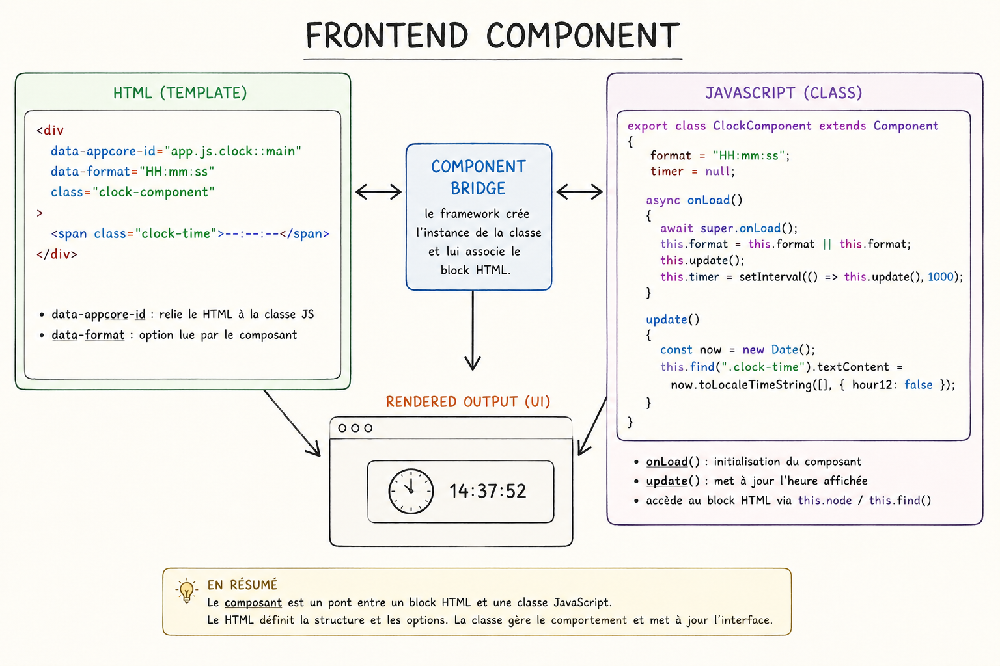

# Règles de conception d’un composant AppCoreJS

## 1. Principe général

Un composant AppCoreJS est un pont entre un bloc HTML et une classe JavaScript.

```html
<div data-appcore-id="app.js.my-component::demo">
  <span class="label"></span>
</div>
```

```js
export class MyComponent extends Component
{
  text = "Hello";

  async onLoad()
  {
    await super.onLoad();
    this.render();
  }

  render()
  {
    this.find(".label").textContent = this.text;
  }
}
```



## 2. Le nœud racine

Le bloc déclaré avec `data-appcore-id` devient le nœud racine du composant :

```js
this.node
```

La classe ne recrée jamais ce nœud.

## 3. Le rôle de `onLoad()`

`onLoad()` initialise le composant :

- charger les styles ;
- convertir les attributs si nécessaire ;
- lire le HTML déclaratif éventuel ;
- attacher les événements ;
- appeler `render()`.

## 4. Les attributs `data-*`

Les attributs HTML sont copiés automatiquement dans l’instance :

```html
<div data-placeholder="Select..." data-multiple="true"></div>
```

```js
this.placeholder
this.multiple
```

Les valeurs restent des chaînes, donc conversion explicite si besoin :

```js
this.multiple = this.multiple === "true";
```

## 5. Le rôle du template

Un template fournit la structure interne par défaut.

Il ne remplace pas `this.node`, seulement son contenu.

Les attributs du template servent de valeurs par défaut et peuvent être surchargés par l’instance HTML.

## 6. Le rôle de `render()`

`render()` ne reconstruit pas tout le composant.

Il alimente les zones existantes :

```js
this.find(".label").textContent = this.text;
```

Une zone absente est ignorée si elle n’est pas indispensable.

## 7. Les usages possibles

Un composant doit pouvoir fonctionner avec :

- HTML inline ;
- template ;
- pilotage JavaScript.